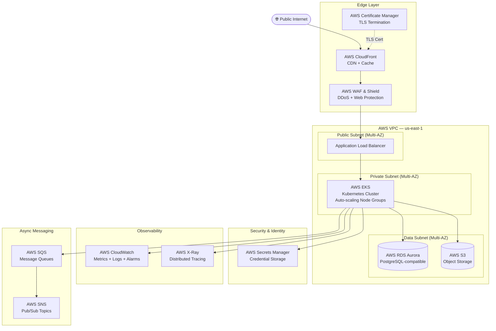
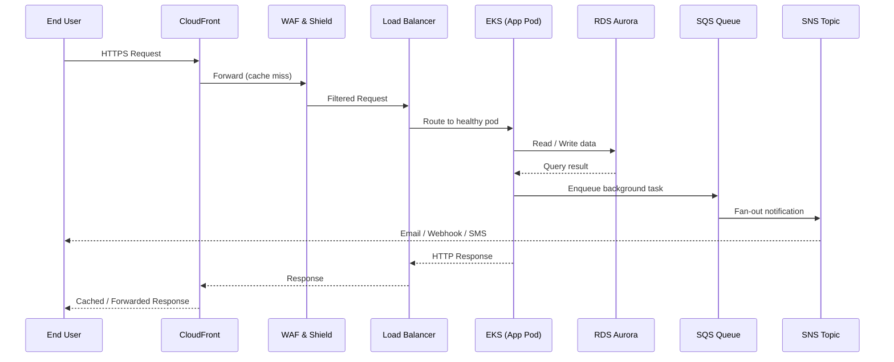
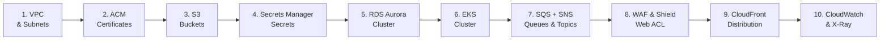

# AWS Public SaaS Platform — customer-portal
## Region: US-EAST-1 (North Virginia) | Environment: Development

---

## 📋 Blueprint Overview

| Field | Value |
|-------|-------|
| **Blueprint ID** | `tpl_84f7e8ef96af` |
| **Provider** | AWS |
| **Category** | WEB APPLICATION |
| **Tier** | PREMIUM |
| **Region** | us-east-1 (North Virginia) |
| **Environment** | Development |
| **Workload Name** | customer-portal |
| **Estimated Monthly Cost** | $400.00 – $700.00 USD |
| **Availability Target** | 99.9% |
| **Scalability Model** | Auto-scaling |
| **Data Classification** | Public |
| **Disaster Recovery** | None |
| **Compliance** | None |

---

## 🏗️ Architecture Narrative

The `customer-portal` SaaS platform is designed as a cloud-native, auto-scaling, publicly accessible web application deployed on AWS in the `us-east-1` (North Virginia) region. The architecture follows a **layered defense-in-depth** model — with traffic flowing from the public internet through a CDN and WAF perimeter, into a containerised application tier, and down to a managed relational database.

### Design Principles

- **Separation of Concerns** — Each layer (networking, compute, data, security, observability, messaging) is decoupled and independently scalable.
- **Managed Services First** — Preference given to fully managed AWS services to reduce operational burden on the development team.
- **Security at Every Layer** — WAF & Shield at the edge, ACM for TLS termination, Secrets Manager for credential management, and IAM for least-privilege access control.
- **Observability by Default** — CloudWatch and X-Ray are baked in from day one, enabling metrics, logs, traces, and alerting across all services.
- **Async-First Integration** — SQS and SNS decouple background workloads from the synchronous request path, improving resilience and scalability.

---

## 🗺️ Architecture Diagram

---

## 🔁 Request Flow

---

## 🧱 Service Breakdown by Layer

### 1. Networking Layer

#### AWS VPC
- Provides isolated network boundary for all compute and data resources.
- Configured with public subnets (ALB), private subnets (EKS nodes), and data subnets (Aurora).
- Internet Gateway for public subnet egress; NAT Gateway for private subnet egress.
- Security Groups and NACLs enforce least-privilege network access between tiers.

#### AWS CloudFront
- Global CDN distribution sitting in front of the ALB.
- Caches static assets (JS, CSS, images) at edge locations worldwide.
- Reduces origin load and improves global latency for SaaS customers.
- Integrates natively with ACM for HTTPS and WAF for edge protection.

---

### 2. Compute Layer

#### AWS EKS (Elastic Kubernetes Service)
- Kubernetes control plane managed by AWS; node groups run on EC2 Auto Scaling Groups.
- Application microservices deployed as containerised workloads (Deployments, Services, Ingress).
- Horizontal Pod Autoscaler (HPA) scales pods based on CPU/memory metrics.
- Cluster Autoscaler scales node groups based on pending pod demand.
- ALB Ingress Controller routes external traffic from the Application Load Balancer into the cluster.

**Key EKS Configuration Decisions:**
- **Managed Node Groups** — AWS manages node lifecycle, patching, and replacement.
- **Private API Endpoint** — EKS API server not exposed to the public internet.
- **IRSA (IAM Roles for Service Accounts)** — Pods assume IAM roles without static credentials.

---

### 3. Data Layer

#### AWS RDS Aurora (PostgreSQL-compatible)
- Fully managed relational database with auto-scaling storage (up to 128 TB).
- Multi-AZ by default: one primary writer + up to 15 Aurora Replicas for read scaling.
- Automated backups retained for 7 days; point-in-time recovery available.
- Performance Insights enabled for query-level monitoring.
- Database credentials stored in and rotated by AWS Secrets Manager.

#### AWS S3
- Object storage for static frontend assets, user-uploaded files, application logs, and data exports.
- Bucket versioning enabled to protect against accidental deletion.
- S3 Origin Access Control (OAC) restricts direct public access; CloudFront serves assets.
- Lifecycle policies transition infrequently-accessed objects to S3-IA or Glacier after 90 days.

---

### 4. Security Layer

#### AWS WAF & Shield
- WAF Web ACL attached to the CloudFront distribution.
- Managed rule groups: AWS Core Rule Set (CRS), SQL injection protection, XSS protection.
- Shield Standard included automatically; Shield Advanced optional for DDoS response team access.
- Rate-based rules throttle abusive IPs automatically.

#### AWS Secrets Manager
- Stores database credentials, API keys, and third-party integration tokens.
- Automatic rotation configured for Aurora credentials (every 30 days).
- EKS pods access secrets via IRSA + Secrets Manager CSI Driver — no secrets in environment variables or container images.

#### AWS Certificate Manager (ACM)
- Provisions and auto-renews public TLS certificates for the SaaS domain.
- Certificates attached to CloudFront distribution for HTTPS termination at the edge.
- No certificate management overhead — ACM handles renewal automatically.

---

### 5. Observability Layer

#### AWS CloudWatch
- Collects metrics from all AWS services: EKS, ALB, Aurora, SQS, SNS, CloudFront.
- Log Groups aggregate application logs from EKS pods via the CloudWatch Agent / Fluent Bit DaemonSet.
- Alarms configured for: high CPU, error rate spikes, Aurora connection saturation, SQS queue depth.
- CloudWatch Dashboard provides a unified operational view.

#### AWS X-Ray
- Distributed tracing across EKS microservices.
- X-Ray SDK integrated into application code to instrument HTTP calls, DB queries, and SQS sends.
- Service Map visualises inter-service dependencies and latency hotspots.
- Sampling rules configured to capture 5% of traces in development (adjustable for production).

---

### 6. Integration Layer

#### AWS SQS (Simple Queue Service)
- Standard queues for async task processing: email delivery jobs, report generation, webhook dispatching.
- Dead Letter Queues (DLQs) capture failed messages after 3 delivery attempts.
- Visibility timeout set to 30 seconds; message retention 4 days.
- EKS worker pods poll queues and process tasks independently of the web request path.

#### AWS SNS (Simple Notification Service)
- Pub/Sub topics for fan-out event broadcasting: user signup notifications, billing alerts, system events.
- Subscribers include: SQS queues (for durable processing), email endpoints, HTTPS webhooks.
- Message filtering policies allow subscribers to receive only relevant event types.

---

## 💰 Cost Breakdown (Estimated Monthly — Development)

| Service | Estimated Cost |
|---------|----------------|
| AWS EKS (control plane) | ~$72/mo |
| EC2 Node Group (2x t3.medium) | ~$60/mo |
| RDS Aurora (db.t3.medium, single AZ) | ~$60/mo |
| CloudFront (10 GB transfer) | ~$10/mo |
| ALB | ~$16/mo |
| S3 (50 GB storage) | ~$2/mo |
| WAF (Web ACL + rules) | ~$10/mo |
| Secrets Manager (5 secrets) | ~$2/mo |
| CloudWatch (logs + metrics) | ~$20/mo |
| X-Ray (traces) | ~$5/mo |
| SQS + SNS | ~$5/mo |
| ACM | Free |
| **Total Estimate** | **~$262 – $462/mo** |

> **Note:** Development costs are intentionally lower than production due to smaller instance sizes, single-AZ Aurora, and reduced traffic volumes. Production costs with multi-AZ, larger instances, and higher traffic will be in the $400–$700+ range.

---

## ⚖️ Trade-off Decisions

| Decision | Choice Made | Alternative Considered | Rationale |
|----------|-------------|----------------------|-----------|
| Compute | EKS | ECS Fargate | EKS chosen for Kubernetes ecosystem portability and advanced scheduling control |
| Database | RDS Aurora | DynamoDB | Relational model suits structured customer portal data with complex queries |
| CDN | CloudFront | Global Accelerator | CloudFront preferred for HTTP/HTTPS caching; Global Accelerator better for TCP/UDP |
| Messaging | SQS + SNS | EventBridge | SQS+SNS sufficient for standard async patterns; EventBridge adds complexity not yet needed |
| Monitoring | CloudWatch + X-Ray | Managed Grafana + Prometheus | Native AWS integration reduces operational overhead in development |

---

## ⚠️ Known Limitations & Assumptions

1. **Single Region** — No DR or failover to a secondary region. Acceptable for development; production should consider at minimum backup-only DR.
2. **Single-AZ Aurora in Dev** — Aurora is configured for single-AZ in this development blueprint to reduce cost. Multi-AZ should be enabled before production promotion.
3. **No Cognito** — User authentication is not included in this blueprint. If the customer portal requires SSO or user pools, add AWS Cognito to the security layer.
4. **No CI/CD Pipeline** — This blueprint covers infrastructure only. Application deployment pipelines (CodePipeline, GitHub Actions, ArgoCD) are managed separately.
5. **Public Data Classification** — Encryption at rest is configured but not enforced at the application layer. If data sensitivity increases, add KMS CMKs and enforce encryption policies.
6. **EKS Node Group Sizing** — Development node group uses `t3.medium` instances. Production should use `m5.xlarge` or larger depending on pod density.

---

## 🚀 Deployment Order (Recommended)

---

## 📦 Resource Inventory

| Resource Type | Count |
|---------------|-------|
| VPCs | 1 |
| CloudFront Distributions | 1 |
| EKS Clusters | 1 |
| RDS Aurora Clusters | 1 |
| S3 Buckets | 1 |
| WAF Web ACLs | 1 |
| Secrets Manager Secrets | 3 |
| ACM Certificates | 1 |
| CloudWatch Log Groups | 1 |
| X-Ray Sampling Rules | 1 |
| SQS Queues | 2 |
| SNS Topics | 2 |
| **Total Resources** | **16** |

---

## 🔐 IAM & Security Posture

- **IRSA** — All EKS workloads use IAM Roles for Service Accounts; no static AWS credentials in pods.
- **Least Privilege** — Each service has a dedicated IAM role with only the permissions it requires.
- **Secrets Rotation** — Aurora credentials rotate automatically every 30 days via Secrets Manager.
- **TLS Everywhere** — All external traffic encrypted via ACM certificates on CloudFront.
- **WAF Rules** — AWS Managed Rule Groups block OWASP Top 10 threats at the edge.
- **VPC Isolation** — EKS nodes and Aurora run in private subnets; not directly accessible from the internet.

---

## 📝 Next Steps

1. **Add Environments** — Promote this blueprint to staging and production environments using `add_blueprint_environment`.
2. **Add Cognito** — Integrate AWS Cognito for user authentication if the portal requires login/SSO.
3. **Add CI/CD** — Configure GitHub Actions or AWS CodePipeline for application deployment to EKS.
4. **Enable CloudTrail** — Add AWS CloudTrail for full API audit logging before production go-live.
5. **Configure Alerts** — Set up CloudWatch Alarms with SNS notifications for on-call alerting.
6. **Scale Testing** — Run load tests against the development environment to validate auto-scaling behaviour before promotion.

---

*Generated by CloudGods.io — AWS Principal Cloud Architect Blueprint Engine*
*Blueprint ID: `tpl_84f7e8ef96af` | Generated: 2026-06-16*

